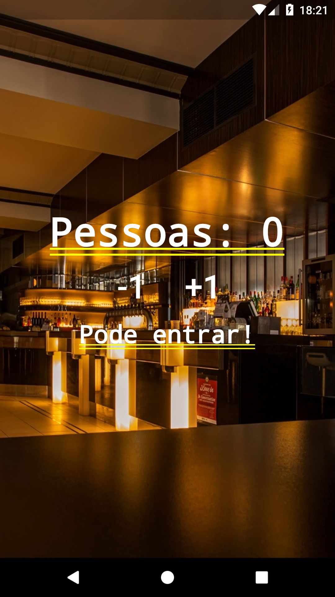
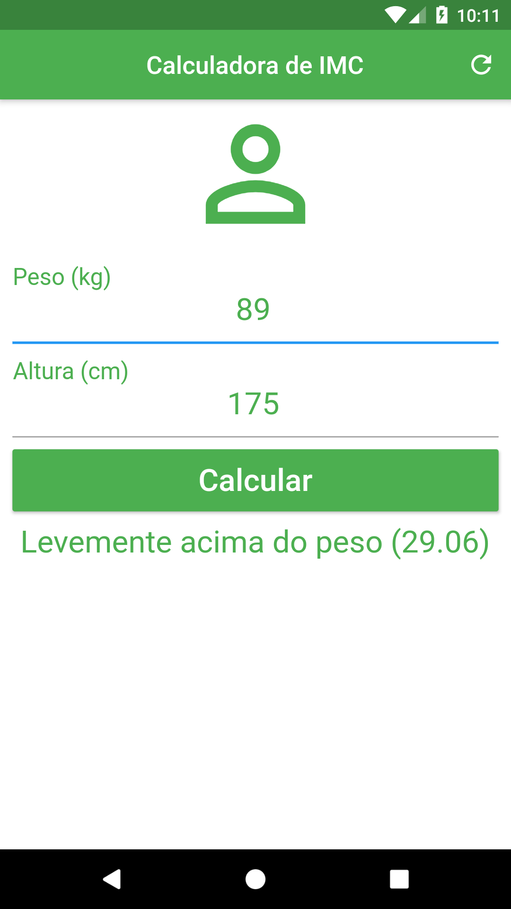
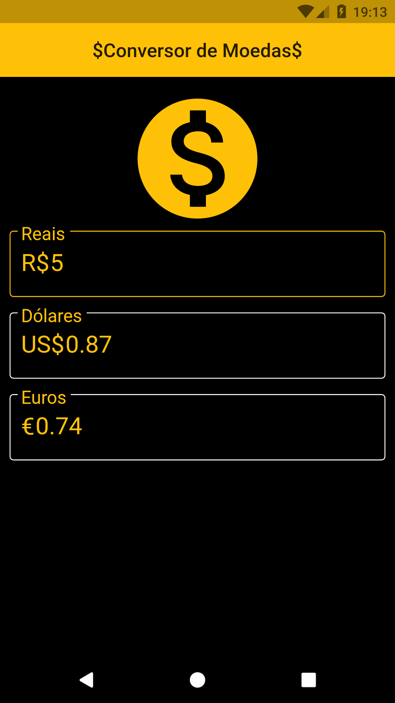

<h1 align="center">
  Flutter Projects
</h1>

<p align="center">
  <a href="#rocket-project">Projects</a>&nbsp;&nbsp;&nbsp;|&nbsp;&nbsp;&nbsp;
  <a href="#computer-technologies">Technologies</a>&nbsp;&nbsp;&nbsp;|&nbsp;&nbsp;&nbsp;
  <a href="#thinking-how-to-use">How to use?</a>&nbsp;&nbsp;&nbsp;|&nbsp;&nbsp;&nbsp;
  <a href="#memo-license">License</a>
</p>

## :rocket: Project

:globe_with_meridians: 
Developed projects to study Flutter!! https://www.udemy.com/course/curso-completo-flutter-app-android-ios/

## Preview

<div style="display: flex">



</div>

## :computer: Technologies
- [Flutter](https://flutter.dev/)
- [Dart](https://dart.dev/)

## :thinking: How to use?

```sh
Open any folder on Android Studio
```

```sh
Run App (shift + f10)
```


## :memo: License

MIT


